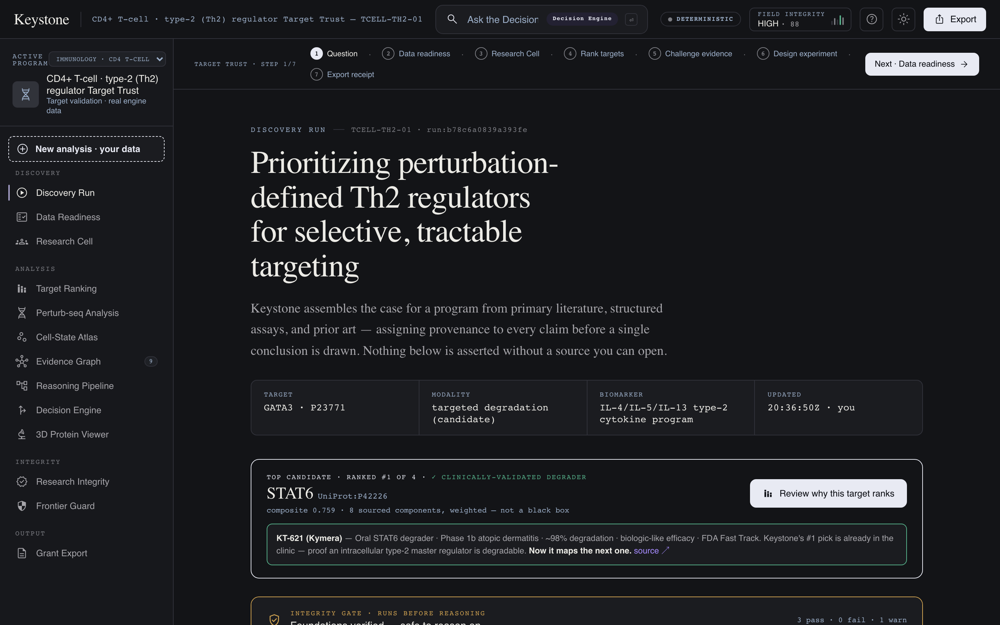
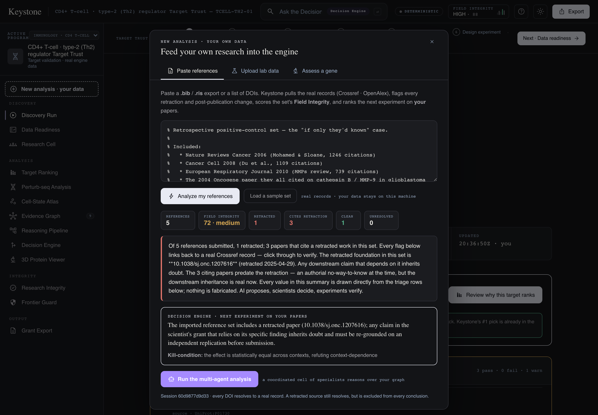
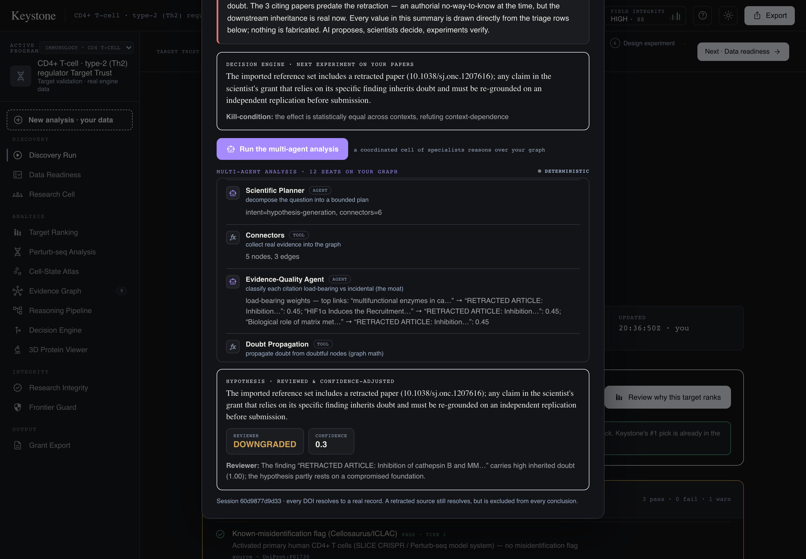
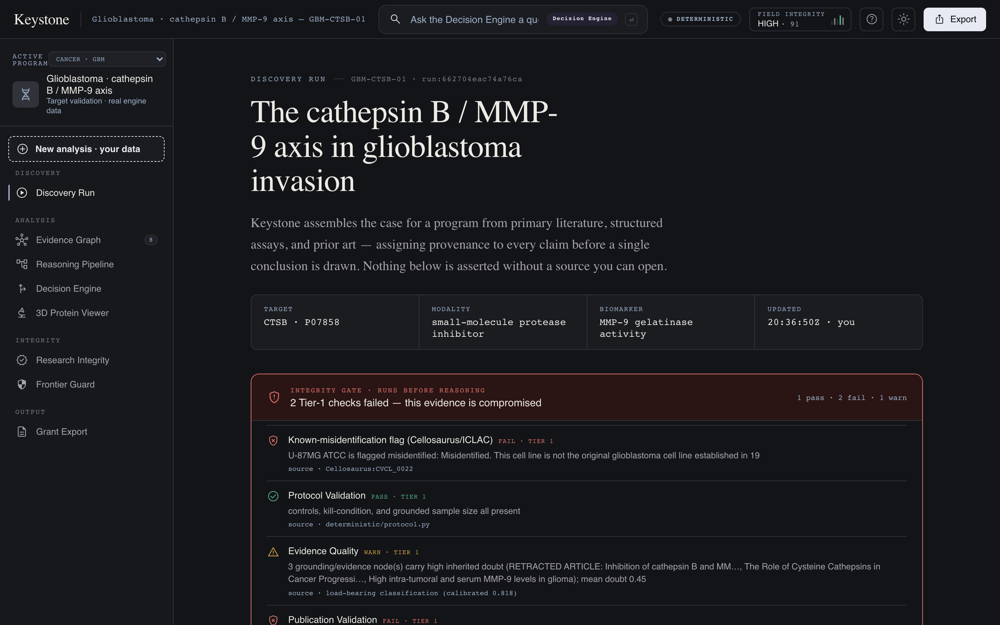

<div align="center">

# 🧬 Keystone — Life Science System

### An agentic scientific discovery workbench that **checks what you build on** before it reasons.

*Literature · evidence integrity · multi-agent reasoning · a decision engine · reproducible artifacts — one continuous, provenance-grounded workflow. AI proposes, scientists decide, experiments verify.*

[](https://claude.com/product/claude-science)
[](https://www.python.org/)
[](tests/)
[](#-scientific-integrity-the-non-negotiables)
[](LICENSE)

<br/>



*The front door: a real target-prioritization run over primary literature, with an integrity gate that runs **before** any reasoning.*

</div>

---

## What Keystone is

**Keystone** coordinates literature, evidence, datasets, biological knowledge, AI reasoning, laboratory data, experiment planning, and publication artifacts into **one reproducible scientific workflow** — for translational biomedical research.

It follows the [**Claude Science**](https://claude.com/product/claude-science) philosophy: bring literature + data + tools + compute + artifacts into a single environment. Claude (the AI) is **one component, not the product** — Claude reasons in prose, a deterministic engine owns every number, and the scientist makes every decision.

The one idea that makes it trustworthy:

> **A resolvable DOI proves a *record* exists — never that a *claim* is true.**
> Keystone tracks that distinction on every claim. A real but **retracted** paper stays visible for context but is **excluded from every conclusion**. Nothing is fabricated: a lookup that fails is marked `unresolved`, never invented.

> Built for **Claude: Life Sciences** — a global hackathon in partnership with the **Gladstone Institutes** (San Francisco). Keystone extends Claude Science into an integrity-first research OS: it doesn't just answer, it shows *what it's standing on*.

---

## The problem it solves

Modern labs don't lack intelligence — they lack **coordination**. Scientists lose hours every day to:

- 📚 **Fragmented tools** — PubMed, Zotero, UniProt, Reactome, ClinVar, ChEMBL, ClinicalTrials.gov, PyMOL, Jupyter, grant docs — twenty tools for one line of thought.
- ⚠️ **Retracted literature** silently contaminating downstream work.
- 🔁 **Irreproducible analyses** — the result is right, the path is lost.
- 🧾 **Grant rigor & methods** rebuilt from scratch every submission.
- 🧭 **No defensible next experiment** — which one settles the question?
- 🕳️ **Scattered provenance** — where did this claim actually come from?

**Intelligence is no longer the bottleneck. Coordination is.**

---

## ✨ Feature tour

### 1 · Bring your own research — three real flows, on the front door

Paste your references, drop a plate-reader CSV, or type any gene. Every result is computed from **real records** and stays on your machine.



| Flow | You give it | Keystone returns |
|------|-------------|------------------|
| **Paste references** (`.bib` / `.ris` / DOIs) | your citation list | real Crossref/OpenAlex records · retraction & post-pub flags · a **Field Integrity score** for *your* set · a Decision-Engine next experiment on *your* papers |
| **Upload lab data** (plate-reader CSV) | a 96-well plate | deterministic QC (Z′-factor · replicate CV · edge effects · blanks) that **downgrades confidence** on failure, with FDA-cite-able thresholds — never a fabricated reading |
| **Assess a gene** | any human symbol | live **Open Targets** disease associations + type-2 relevance — proof it generalizes past the demo |

> In the screenshot above, a 5-reference set is scored **72 / medium**, flagged **1 retracted + 3 that cite a retraction**, and gets a real next-experiment naming the retracted DOI. This is the *"if only they'd known"* retrospective, built in as its own positive control.

### 2 · Multi-agent AI reasoning — on *your* graph

A coordinated cell of **12 specialist seats** (agents + deterministic tools) reasons over the evidence you just imported — planner → connectors → evidence-quality → doubt propagation → contradiction mining → hypothesis → experiment design → statistics → **adversarial reviewer** → reproducibility ledger → PI synthesis. Live Claude prose when a key is present; deterministic (and never broken) otherwise.



> The **Reviewer Agent downgrades confidence to 0.3** because the hypothesis partly rests on a retracted foundation — the model *removing unearned confidence*, on the record. Every seat is labelled `AGENT` (semantic) or `TOOL` (deterministic): Claude never invents a statistic; the tools never write prose.

### 3 · Research integrity — the gate that runs *before* reasoning

Keystone triages every source against Crossref / Retraction Watch / Cellosaurus **before** it draws a conclusion. Red here is not a bug — it's the product catching something real.



> The glioblastoma program's foundational RNAi paper is genuinely **retracted**, and **U-87MG is a real Cellosaurus-flagged misidentified cell line** (`CVCL_0022`). Keystone surfaces both, propagates the doubt across the citation graph (the *blast radius*), and **excludes** the retracted source from every conclusion while keeping it visible for integrity context.

### 4 · A search bar wired to the engine

The header search is a scientist's command bar: a **research question** routes to the Decision Engine, a **gene** to live Open Targets, a **DOI** to prior art — each result real and sourced.

---

## 🔬 Four real research programs

Switch programs from the sidebar and the entire workbench re-derives from that domain's real, pinned, DOI-resolvable evidence. Per-program capabilities filter the navigation so you never land on an empty tab.

| Program | Domain | Target | The real story |
|---------|--------|--------|----------------|
| **CD4⁺ T-cell · Th2** ⭐ | Immunology / drug discovery | GATA3 · STAT6 | Ranks STAT6 **#1** (validated by KT-621, Kymera, Phase 1b), then finds the *next* degradable master regulator using real Gladstone Perturb-seq metrics |
| **Glioblastoma** | Oncology | Cathepsin B / MMP-9 | A retracted foundational paper + real downstream citers + a real misidentified cell line — a complete integrity case |
| **Intracerebral hemorrhage** | Neurology | MMP-9 (P14780) | A real 2009 MMP-9 retraction, 59 real citers, and a genuine *dual-role* contradiction (Zhao et al., Nat. Med. 2006) |
| **Insulin resistance** | Metabolism | IRS-1 / PI3K–Akt | The insulin-signalling literature audited around the IRS-1 axis — a second, independent integrity domain |

The flagship carries **measured perturbation metrics from the real Gladstone–UCSF CD4⁺ T-cell genome-scale Perturb-seq study** (Zhu et al., 2025) — downstream-DE count, on-target knockdown, and cross-donor reproducibility. FBXO32's cross-donor *r ≈ 0.13* is a **measured** reason its preprint nomination stays provisional.

---

## 🧠 How it works — one connected spine

```
  Scientist ──(.bib / .ris / DOIs / plate CSV / gene)──►  Keystone
       │
       ▼
  📚 EVIDENCE GRAPH ......... real DOIs · Cellosaurus · ClinVar · Reactome ·
                             ClinicalTrials.gov · UniProt · PDB — or 'unresolved'
       │
       ▼
  🛡️ INTEGRITY GATE ........ retracted / cites-a-retraction / misidentified /
                             high-doubt / clean — with doubt propagated across the graph
       │
       ▼
  🧠 MULTI-AGENT REASONING .. Planner ▸ Evidence-Quality ▸ Hypothesis ▸ Design ▸
                             Statistics ▸ Reviewer (downgrades) ▸ PI (synthesizes)
       │
       ▼
  🧪 DECISION ENGINE ........ competing hypotheses ranked by Expected Info Gain ·
                             cost · risk → the falsifiable next experiment (n/arm computed)
       │
       ▼
  📄 GRANT & PUBLICATION .... NIH R&R + STAR Methods rigor · evidence appendix ·
                             reproducibility hash — human-gated (rule 1)
       │
       ▼
  🧫 LEDGER / MEMORY ........ content-hashed; same hash re-runs to the same result;
                             answers "has this been tried before?"
       │
       ▼
  🖥️ CLAUDE DESKTOP ........ the same tools via MCP + an Agent Skill — no app open
```

**Research Integrity is the first station, not the identity.** The scientist enters through it, flows into the multi-agent Decision Engine and experiment plan, out to the publication artifact, and back into Claude Desktop — one content-hashed ledger throughout, nothing loses context.

---

## 🚀 Quickstart

### Option A — Python (recommended for development)

```bash
git clone https://github.com/jaisogani-ai/Keystone-Life-Science-System.git
cd Keystone-Life-Science-System

pip install -e . fastapi uvicorn        # workbench + engine (offline, deterministic)
python -m keystone.ui.server            # → open http://127.0.0.1:8000
```

Keystone runs **fully offline and deterministic** with no key — every number is computed from committed real-data fixtures.

### Option B — Docker

```bash
docker build -t keystone .
docker run -p 8000:8000 keystone       # → http://127.0.0.1:8000
```

### Pages

| Route | What |
|-------|------|
| `/` | **Front door** — the Target Trust workbench + New Analysis (your data) |
| `/labs` | Scientific Workspaces — integrity center, notebook, biology chain, pattern miner, lab agent |
| `/workspace` | Connected View — protein · genome · pathways · trials · evidence graph, synchronized |
| `/classic` | The prior decision-engine front door |

---

## 🔑 Live Claude layer (optional) — and how your key stays safe

Keystone is **100% functional offline**. A key only activates the *semantic* layer: the plain-language integrity summary, the Reviewer's critique, the PI's synthesis, and live load-bearing judgement. **Every number stays identical either way.**

```bash
cp .env.example .env          # then paste your key into .env
#   ANTHROPIC_API_KEY=sk-ant-...
#   KEYSTONE_MODEL=claude-sonnet-5
python -m keystone.ui.server  # the badge flips to "CLAUDE · LIVE"
```

> 🔒 **Your API key never enters the repository.** `.env` is git-ignored (see [`.gitignore`](.gitignore)), loaded server-side only, and there is a regression test — [`tests/test_safety_invariants.py`](tests/test_safety_invariants.py) — that fails if a key ever leaks into an API response. Only [`.env.example`](.env.example) (a placeholder) is committed.

---

## 🖥️ Use Keystone inside Claude Desktop (MCP)

Keystone ships as an **MCP server** so Claude can call the engine with no app open. Register it:

```json
{
  "mcpServers": {
    "keystone": { "command": "python", "args": ["-m", "keystone.mcp_server"] }
  }
}
```

Then ask Claude *"check these DOIs for retractions"* → it calls `check_reference_integrity`. Other tools include `competing_hypotheses`, `next_experiment`, `field_integrity`, `check_prior_art`, `review_bench_data`, `search_clinical_trials`, `evidence_graph`, `validation_metrics`, and `publication_report`. The [`skills/keystone-workbench/`](skills/keystone-workbench/) Agent Skill teaches Claude *when* to reach for each.

---

## 🧾 Scientific integrity — the non-negotiables

Every claim in Keystone carries a machine-checked status (in [`keystone/deterministic/claim_status.py`](keystone/deterministic/claim_status.py), in the API response — not a cosmetic badge):

- **Source record verified** — the identifier resolved and metadata matched. *Not* "supports the claim."
- **Claim type** — `evidence` · `computed` · `hypothesis` · `missing`. A claim is `evidence` **only** with an exact source link; a real DOI on an unrelated sentence is `missing`.
- **Integrity state** — `normal` · `retracted` · `concern` · `unverified`.
- **Evidence status is conclusion-specific** — the same claim can *support* conclusion A and *contradict* conclusion B. A retracted source resolves to **`excluded`** for every conclusion.

**The rules the engine enforces:**

1. 🚫 **No fabrication** — every number is computed, a labelled estimate, or a labelled qualitative. Failed lookups are `unresolved`, never invented.
2. 🧮 **Claude writes prose; tools write numbers** — the semantic/deterministic boundary is the rigor.
3. 🔁 **Reproducible** — a content-hashed ledger re-runs to an identical hash.
4. ✋ **Human-gated** — every recommendation is a draft that requires a scientist's sign-off, written to the ledger with attribution.
5. 🛑 **Refuses misuse** — no pathogen design, no toxicity enhancement, no assay-evasion, no PHI, no clinical/diagnostic claims. Refusals are on the record (Frontier Guard).

---

## ✅ Testing & reproducibility

```bash
python -m pytest -q                          # 267 tests, offline & deterministic
python -m keystone.decision_engine           # decision engine on the flagship program
python -m keystone.agents.flaw_catch_eval     # the self-test: does it catch planted flaws?
```

Keystone **self-tests**: the validation panel plants known flaws and measures its own catch rate honestly. The load-bearing classifier reaches **0.818 agreement** with a hand-labelled reference set across two independent domains (single-annotator baseline). You verify the tool before you trust it.

---

## ☁️ Deploy (Fly.io)

```bash
flyctl launch --no-deploy --copy-config --name keystone-workbench
flyctl deploy                                 # fly.toml ships in the repo
```

`KEYSTONE_OFFLINE=1` is the deploy default (free-tier-safe, deterministic). Enable live Claude with `flyctl secrets set ANTHROPIC_API_KEY=sk-ant-...` and redeploy — the key lives in Fly secrets, never in the image.

---

## 🗂️ Project structure

```
keystone/
├── core.py                    data model · rule-enforced Hypothesis · content-hashed Ledger
├── decision_engine.py         THE PRODUCT — competing hypotheses → next-experiment recommendation
├── orchestrator.py            the 12-seat multi-agent pipeline (agents + tools)
├── field_integrity.py         Field Integrity Score (0–100) for a corpus, every weight exposed
├── integrity_report.py        per-reference triage (retracted / cites-retraction / clean)
├── {gbm,ich,insulin,tcell}_spec.py   pinned REAL identifiers per program (single source of truth)
├── data_{gbm,ich,insulin,tcell}.py   build each evidence graph from real connector output
├── gladstone_data.py          real Gladstone CD4⁺ Perturb-seq metrics (measured)
├── agents/
│   ├── reasoner.py            HeuristicReasoner (offline, transparent)
│   ├── claude_reasoner.py     ClaudeReasoner (live API, schema-validated, deterministic fallback)
│   ├── bench_reviewer.py      plate-reader QC that downgrades confidence
│   └── pattern_miner.py       corpus-scale integrity detectors
├── deterministic/             stats · doubt propagation · target_ranking · claim_status · research_cell
├── connectors/                OpenAlex · Crossref/RetractionWatch · Cellosaurus · UniProt · ChEMBL ·
│   └── fixtures/              Reactome · ClinVar · ClinicalTrials.gov · Open Targets — committed real responses
├── artifacts/                 evidence-graph & 3D renderers · repro_bundle (grant .zip)
├── ingest/references.py       parse .bib/.ris/DOIs → real evidence graph (bring-your-own-data)
├── ml/                        Perturb-seq / type-2 signature pipeline
├── mcp_server.py              Keystone as an MCP server for Claude Desktop
└── ui/
    ├── server.py              FastAPI backend — a pure projection of the engine (no logic)
    └── static/                the single-page instrument (run.html + lib/ks-design.js)
tests/                         267 tests (integrity · claims · connectors · UI · safety · per-program)
skills/keystone-workbench/     Agent Skill (SKILL.md) — teaches Claude the spine & the discipline
examples/                      sample reference sets, bench plates, and corpora for the demos
```

---

## ⚖️ Honest limits

Keystone **ranks hypotheses and drafts artifacts — it does not discover a target, and it never replaces laboratory validation or scientific judgement.** The headline functional-effect signal is literature-supported and measured-in-dataset (real DOIs + real Gladstone metrics), **not a trained predictive model**; the single-cell *classifier* matrix is synthetic/exploratory (labelled everywhere, never a ranking input). No association is stated as causal. **"Designed for scientist review," not "scientist-validated."**

> **AI proposes · scientists decide · experiments verify.**

---

## 📄 License

[MIT](LICENSE) · See [`ARCHITECTURE.md`](ARCHITECTURE.md) and [`CONTRIBUTING.md`](CONTRIBUTING.md) for the semantic/deterministic boundary and contribution guide.

<div align="center"><br/><sub>Built with <b>Claude: Life Sciences</b> × <b>Gladstone Institutes</b> · Check what you build on.</sub></div>
